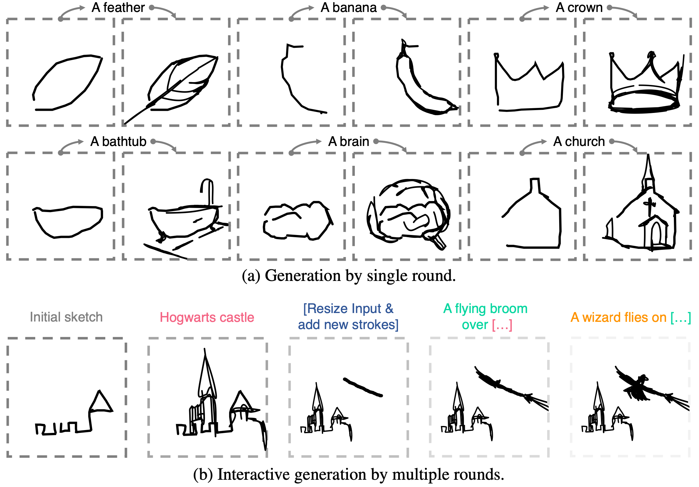

<div align="center">
  
# SketchXAI: A First Look at Explainability for Human Sketches

<a href="https://pytorch.org/get-started/locally/"></a>
[](https://cvpr.thecvf.com/)

</div>

This paper, for the very first time, introduces human sketches to the landscape of XAI. We argue that, sketch as a "human-centred" data form, represents a natural interface to study explainability. We focus on cultivating sketch-specific explainability designs. This starts by identifying strokes as a unique building block that offers a degree of flexibility in object construction and manipulation impossible in photos. Following this, we design a simple explainability-friendly sketch encoder that accommodates intrinsic properties of strokes: shape, location, and order. We then move on to define the first ever XAI task for sketch, that of stroke location inversion SLI. Just as we have heat maps for photos, and correlation matrices for text, SLI offers an explainability angle to sketch in terms of asking a network how well it can recover stroke locations of an unseen sketch. We offer qualitative results for readers to interpret, in the form of snapshots of the SLI process in the paper and videos here. A minor but interesting note is that, thanks to its sketch-specific design, our sketch encoder also yields the best sketch recognition accuracy to date, while having the smallest number of parameters.



## Link

[Home page](https://sketchxai.github.io/)


## Citation

```
@inproceedings{qu2023sketchxai,
  title={SketchXAI: A First Look at Explainability for Human Sketches},
  author={Qu, Zhiyu and Gryaditskaya, Yulia and Li, Ke and Pang, Kaiyue and Xiang, Tao and Song, Yi-Zhe},
  booktitle={CVPR},
  year={2023}
}
```


## Instructions


### Dependencies

```
pip install -r requirements.txt
```

### QuickDraw Dataset

Download the QuickDraw data from [here](https://github.com/tensorflow/magenta/tree/master/magenta/models/sketch_rnn#datasets). Use ```quickdraw_to_hdf5.py``` and set **Category30** or **Category345** to preprocess the data and generate corresponding hdf5 files.

### Training

Note: We use DDP for all our training processes. Testing/inference with DDP is somewhat more tricky than training. **You should ensure the number of testing data is divisible to the number of your GPUs, otherwise the results might be incorrect.**
Say, there’re 100 batches in your testing set, while there are 8 GPUs (100 % 8 = 4). The DistributedSampler will repeat part of the data and expand it to 104 (104 % 8 = 0) such that the data could be evenly loaded into each GPU.

For our work, we use **5 GPUs** and **a batch size of 100** to match the testset of QuickDraw.

#### Train QuickDraw on 345 categories with ViT-Base/Tiny

```
$Home/anaconda/bin/python -m torch.distributed.launch --nproc_per_node 5 main.py -log 'vit_base_log/' -ckpt 'vit_base_ckpt/' -bs 100 -dataset_path '/home/Quickdraw/Category345/' -embedding_dropout 0.1 -attention_dropout 0.1 -mask False -pretrain_path 'google/vit-base-patch16-224'

$Home/anaconda/bin/python -m torch.distributed.launch --nproc_per_node 5 main.py -log 'vit_tiny_log/' -ckpt 'vit_tiny_ckpt/' -bs 100 -dataset_path '/home/Quickdraw/Category345/' -embedding_dropout 0.1 -attention_dropout 0.1 -mask False -pretrain_path 'WinKawaks/vit-tiny-patch16-224'
```

#### Use our trained models

```
$Home/anaconda/bin/python -m torch.distributed.launch --nproc_per_node 5 main.py -log 'vit_base_log/' -ckpt 'vit_base_ckpt/' -bs 100 -dataset_path '/home/Quickdraw/Category345/' -embedding_dropout 0.1 -attention_dropout 0.1 -mask False -pretrain_path 'WinKawaks/SketchXAI-Base-QuickDraw345'

$Home/anaconda/bin/python -m torch.distributed.launch --nproc_per_node 5 main.py -log 'vit_tiny_log/' -ckpt 'vit_tiny_ckpt/' -bs 100 -dataset_path '/home/Quickdraw/Category345/' -embedding_dropout 0.1 -attention_dropout 0.1 -mask False -pretrain_path 'WinKawaks/SketchXAI-Tiny-QuickDraw345'
```

#### Stroke location inversion

Recovery/Transfer

```
$Home/anaconda/bin/python inversion/main_inversion.py -pretrain_path 'WinKawaks/SketchXAI-Base-QuickDraw30' -dataset_path '/home/Quickdraw/Category30' -analysis 'recovery'

$Home/anaconda/bin/python inversion/main_inversion.py -pretrain_path 'WinKawaks/SketchXAI-Base-QuickDraw30' -dataset_path '/home/Quickdraw/Category30' -analysis 'transfer'
```
